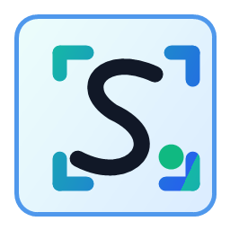

<p align="center">
  
</p>

<h1 align="center">SnipEasy</h1>

<p align="center">
  <strong>一键截屏工作站 — 截图、录屏、标注、分享，一气呵成。</strong>
</p>

<p align="center">
  <a href="#032-更新亮点">0.3.2 更新</a> &bull;
  <a href="#功能特性">功能特性</a> &bull;
  <a href="#快速开始">快速开始</a> &bull;
  <a href="#安装部署">安装部署</a> &bull;
  <a href="#使用说明">使用说明</a> &bull;
  <a href="#配置选项">配置选项</a> &bull;
  <a href="#项目架构">项目架构</a> &bull;
  <a href="#开发指南">开发指南</a> &bull;
  <a href="#路线规划">路线规划</a> &bull;
  <a href="#开源协议">开源协议</a>
</p>

<p align="center">
  
  
  
  
  
</p>

---

## 项目简介

SnipEasy 是一款轻量级、热键驱动的 Windows 桌面截屏工作站，基于 .NET 9 构建，融合 WPF 与 WinForms 技术。按下快捷键即可截取屏幕区域、进行专业标注，并直接粘贴到聊天窗口、工单系统或文档中。同时支持屏幕录屏（含音频）、截图贴纸悬浮、屏幕取色等功能——全程无需离开当前工作流。

**适用人群：** 开发者、测试工程师、技术文档编写者，以及任何需要在 Windows 上快速截屏的用户。

---

## 0.3.2 更新亮点

- **复制后保持后台**：截图点击“复制”后不再自动弹出 SnipEasy 主窗口，可立即粘贴到目标应用
- **录屏暂停与继续**：录制浮窗可随时暂停或继续，暂停时间不会计入界面计时
- **明确的完成录制操作**：浮窗提供“完成录制”按钮，结束后继续进入保存或取消确认
- **更柔和的截图覆盖层**：移除智能窗口识别的大面积蓝色填充，仅保留中性窗口轮廓
- **智能窗口截图**：悬停自动识别窗口边界，单击截取窗口，拖动继续使用自由框选
- **离线 OCR 识字**：调用 Windows 本地 OCR，识别结果直接复制到剪贴板，图片无需上传
- **延时截图**：支持立即、3 秒、5 秒和 10 秒倒计时
- **真实模糊与水印修复**：敏感区域使用真实模糊效果，区域截图会正确渲染水印
- **贴纸状态恢复**：应用重启后恢复仍在有效期内的截图贴纸
- **生产级可靠性升级**：用户数据迁移到本机标准目录，设置与历史采用线程安全原子写入，Release 构建零警告
- **隐私与发布安全**：诊断包默认排除用户设置、历史、用户名和机器名；签名证书不再进入仓库

---

## 功能特性

### 区域截图 <kbd>F1</kbd>

- 全虚拟桌面捕获，**多显示器支持**
- 鼠标悬停自动识别窗口，**单击截取窗口、拖动自由框选**
- 支持 0/3/5/10 秒**延时截图**
- 拖拽选择任意区域，像素级精确控制
- **方向键**微调选区（1px，<kbd>Shift</kbd>+方向键 10px）
- 四角控制柄调整大小
- 四种输出方式：**复制到剪贴板**、**保存为 PNG**、**钉为贴纸**、**离线 OCR 识字**
- OCR 使用 Windows 本地语言能力，图片无需上传云端

### 9 种标注工具

| 工具 | 说明 |
|:-----|:-----|
| **选择** | 点击选中，拖拽移动，控制柄调整大小，<kbd>Delete</kbd> 删除 |
| **画笔** | 自由手绘，自动曲线平滑 |
| **矩形** | 可调边框宽度的矩形轮廓 |
| **椭圆** | 可调边框宽度的椭圆轮廓 |
| **文字** | 可内联编辑的文本框，带彩色边框 |
| **箭头** | 矢量箭头，填充箭头（流几何图形） |
| **马赛克** | 像素化画笔和矩形填充（10px 块平均） |
| **高亮** | 半透明黄色覆盖矩形 |
| **模糊** | 对所选区域应用真实模糊效果，用于遮挡敏感信息 |

- **5 种颜色预设** — 红、蓝、琥珀、绿、黑
- **可调边框粗细** — 滑块控制
- **撤销**（<kbd>Ctrl</kbd>+<kbd>Z</kbd>）— 支持笔画、元素添加和位置移动的撤销
- **元素操作** — 点击选中、拖拽移动、控制柄调整、方向键微调

### 屏幕录屏 <kbd>F2</kbd>

- **双后端架构** — FFmpeg MP4（主）+ 可手动启用的内置 AVI 兼容模式
- **FFmpeg MP4**：H.264（`libx264`）、CRF 质量控制、`yuv420p`、`+faststart` 网络友好
- **音频采集**：系统音频和/或麦克风（DirectShow），双输入 `amix` 混音
- **AAC 音频**，192kbps，48kHz
- **3 种性能预设**：

| 预设 | 帧率 | CRF | 编码预设 | 适用场景 |
|:-----|:----:|:---:|:---------|:---------|
| 流畅（默认） | 8 FPS | 30 | `ultrafast` | 长时间录制，低 CPU 占用 |
| 均衡 | 12 FPS | 26 | `veryfast` | 教程和演示 |
| 高画质 | 24 FPS | 22 | `faster` | 高质量短片 |

- 可配置范围：**1–30 FPS**、**CRF 18–35**
- **草稿系统** — 录屏先存为草稿，用户决定保存或丢弃
- **状态悬浮窗** — 实时计时器 + 保存/取消 UI，通过 `WdaExcludeFromCapture` 自动排除在录屏之外
- **暂停/继续与完成录制** — 暂停时停止采集且不累计暂停时长，可直接点击“完成录制”

### 贴纸钉图 <kbd>F3</kbd>

- 将剪贴板图片钉为**无边框、置顶悬浮窗口**
- **滚轮缩放**（0.1x – 10x）
- 拖拽移动，双击关闭
- **状态持久化** — 贴纸在应用重启后恢复，7 天自动清理

### 屏幕取色 <kbd>F4</kbd>

- **实时放大镜** — 16×16 像素区域 10 倍放大，带十字准星
- **实时预览**，50ms 刷新间隔
- **三种格式输出**：HEX（`#RRGGBB`）、RGB（`rgb(R, G, B)`）、HSL（`hsl(H, S%, L%)`）
- 点击复制 HEX，各格式独立复制按钮
- **取色历史** — 最近 10 次取色记录

### 系统与效率

- **系统托盘** 集成 — 最小化到托盘、右键菜单、气泡通知
- **全局热键** — 双重注册策略（Win32 `RegisterHotKey` + 低级键盘钩子兜底）
- **自定义热键** — 设置中实时录制 UI，支持 Ctrl/Alt/Shift/Win 组合键
- **截屏历史** — 可搜索、可筛选、CSV 导出，上限 1000 条，可配置保留天数
- **水印支持** — 模板变量：`{UserName}`、`{MachineName}`、`{Timestamp}`
- **首次引导** — 卡片式新手教程，介绍所有功能

### 稳定可靠

- **单实例运行** — 命名 Mutex 互斥锁
- **全局异常处理** — Dispatcher、AppDomain、TaskScheduler 三级捕获，自动生成崩溃报告
- **线程安全原子写入** — 写入临时文件后通过 `File.Replace`/原子移动替换目标，降低并发写入与断电损坏风险
- **滚动日志** — 2MB 上限，3 个归档文件
- **隐私友好的诊断包** — 默认仅包含环境报告和日志，不包含设置、历史、用户名或机器名

---

## 快速开始

```bash
# 克隆仓库
git clone https://github.com/ywx914705/SnipEasy.git
cd SnipEasy

# 构建并运行
dotnet run --project SnipEasy.App
```

首次启动会显示新手引导，介绍所有快捷键功能。按下 <kbd>F1</kbd> 即可开始截图。

---

## 安装部署

### 环境要求

- **Windows 10**（1809+）或 **Windows 11**
- 从源码构建需要 **.NET 9.0 SDK** — [下载地址](https://dotnet.microsoft.com/download/dotnet/9.0)
- 运行安装版需要 **.NET 9 Desktop Runtime**
- 离线 OCR 需要 Windows 已安装至少一个对应语言的 OCR/语言包

### 从源码构建

```bash
# Debug 构建
dotnet build SnipEasy.sln

# Release 构建
dotnet build SnipEasy.sln -c Release

# 直接运行
dotnet run --project SnipEasy.App
```

### 安装包（可选）

使用 PowerShell 构建 Inno Setup 安装包：

```powershell
powershell -NoProfile -ExecutionPolicy Bypass -File installer/Build-SnipEasy-Setup.ps1
```

生成 `website/downloads/SnipEasy-Setup.exe`，可选打包 FFmpeg。

### FFmpeg（可选，用于 MP4 录屏）

如需 MP4 录屏和音频支持，请将 `ffmpeg.exe` 放置在以下位置之一：

1. `tools/ffmpeg/ffmpeg.exe`（可执行文件旁边，安装包会自动打包）
2. 系统 `PATH` 中的任意目录
3. 在设置中指定自定义路径

没有 FFmpeg 时，应用默认阻止高负载的 AVI 录制；如确有兼容需求，可在设置中手动开启内置 AVI 模式（无音频）。

---

## 使用说明

### 快捷键

| 快捷键 | 功能 | 可自定义 |
|:-------|:-----|:--------:|
| <kbd>F1</kbd> | 区域截图 | ✅ |
| <kbd>F2</kbd> | 开始/完成录屏 | ✅ |
| <kbd>F3</kbd> | 将剪贴板图片钉为贴纸 | ✅ |
| <kbd>F4</kbd> | 屏幕取色器 | ✅ |

所有快捷键均支持自定义组合键，可搭配 <kbd>Ctrl</kbd>、<kbd>Alt</kbd>、<kbd>Shift</kbd>、<kbd>Win</kbd> 修饰键。在 设置 → 快捷键 中通过实时录制 UI 修改。

### 截图流程

1. 按下 <kbd>F1</kbd> — 全屏覆盖层出现
2. 悬停高亮目标窗口并**单击选中**，或直接**拖拽**自由框选
3. 使用工具栏 **标注**（画笔、形状、文字、箭头、马赛克、高亮、模糊）
4. 选择：**复制**（剪贴板）、**保存**（PNG 文件）、**钉图**（悬浮贴纸）或 **识字**（离线 OCR）

### 录屏流程

1. 按下 <kbd>F2</kbd> — 开始录屏，浮动状态窗出现
2. 需要中断时点击 **暂停**，之后点击 **继续**恢复采集
3. 点击 **完成录制**，或再次按下 <kbd>F2</kbd> 结束录屏
4. 在决策 UI 中选择 **保存** 或 **取消**

### 命令行测试

```bash
# 全屏截图测试（无界面，完成后自动退出）
dotnet run --project SnipEasy.App -- --capture-once

# AVI 录屏测试（2 秒，无界面）
dotnet run --project SnipEasy.App -- --record-test

# FFmpeg 暂停/继续录屏测试（无界面）
dotnet run --project SnipEasy.App -- --record-pause-test
```

成功退出码 `0`，失败退出码 `1`。可用于 CI/CD 流水线。

---

## 配置选项

所有配置存储在 `%LOCALAPPDATA%/SnipEasy/settings.json`，可通过设置界面修改。

| 分类 | 选项 |
|:-----|:-----|
| **路径** | 截图目录、视频目录 |
| **录屏** | 性能预设、帧率（1–30）、CRF（18–35）、FFmpeg 路径、AVI 兜底开关 |
| **音频** | 系统音频采集 + 设备选择、麦克风采集 + 设备选择 |
| **水印** | 开关、模板（`{UserName}`、`{MachineName}`、`{Timestamp}`） |
| **快捷键** | 四个快捷键均可自定义，支持一键恢复默认 |
| **通用** | 延时截图、开机自启、关闭时最小化到托盘、历史保留天数（30/90/180/365/永久） |
| **诊断** | FFmpeg 自检（gdigrab、dshow、libx264、AAC、音频设备列表） |

---

## 项目架构

```
SnipEasy.App/
├── App.xaml.cs                      # 入口点，单实例、DI 启动、CLI 路由
├── MainWindow                       # 主窗口，设置 UI，历史列表
├── RegionCaptureWindow              # 全屏覆盖层 + 9 种标注工具
├── RecordingStatusWindow            # 浮动录屏状态窗（自动排除录屏）
├── ColorPickerWindow                # 屏幕取色器（实时放大镜）
├── StickerWindow                    # 悬浮贴纸窗口
├── FirstRunWindow                   # 新手引导
│
├── Models/
│   ├── AppSettings                  # 全部用户配置
│   ├── CaptureRecord                # 历史记录模型
│   └── RecordingPerformanceProfiles # 3 种性能预设
│
├── Services/
│   ├── RecordingServiceCoordinator  # FFmpeg/AVI 策略协调器
│   ├── FfmpegRecordingService       # MP4 + 音频录制（FFmpeg）
│   ├── LocalAviRecordingService     # 内置 AVI 兜底
│   ├── ScreenCaptureService         # 全屏截图、裁剪、水印
│   ├── WindowSelectionService       # 窗口识别与可视边界解析
│   ├── OcrService                   # Windows 本地 OCR
│   ├── HotkeyManager                # 全局热键（双重注册）
│   ├── TrayService                  # 系统托盘
│   ├── CaptureHistoryService        # 历史记录持久化、搜索、CSV 导出
│   ├── StickerManager               # 贴纸生命周期管理
│   ├── ClipboardService             # 剪贴板操作
│   ├── CrashReportService           # 崩溃报告自动生成
│   └── DiagnosticPackageService     # 诊断包导出
│
├── ViewModels/
│   ├── MainViewModel
│   ├── RecordingViewModel
│   ├── HistoryViewModel
│   └── SettingsViewModel
│
├── Storage/
│   └── JsonFileStore<T>             # 原子化 JSON 文件持久化
│
└── Native/
    └── NativeMethods                # P/Invoke（RegisterHotKey、SetWindowDisplayAffinity 等）
```

### 核心设计决策

- **MVVM** — 基于 CommunityToolkit.Mvvm，使用源生成器（`[RelayCommand]`、`[ObservableProperty]`）
- **依赖注入** — 通过 `Microsoft.Extensions.DependencyInjection` 管理所有服务生命周期
- **策略模式** — 录屏后端协调器优先使用 FFmpeg，仅在用户明确开启时允许 AVI 兼容模式
- **双重热键注册** — Win32 `RegisterHotKey` 为主，低级键盘钩子为兜底
- **原子化持久化** — `JsonFileStore<T>` 使用进程内锁、临时文件与原子替换，防止并发写入和数据损坏
- **自包含冒烟测试** — `--capture-once` 和 `--record-test` 绕过 DI，适用于无界面 CI 环境

---

## 开发指南

### 运行测试

```bash
dotnet test SnipEasy.App.Tests
```

测试套件包含 **119 项单元测试**，覆盖模型、服务和工具类，使用 xUnit + Moq。

### 项目规范

- **根命名空间**：`SnipEasy.App`
- **代码质量**：.NET 内置分析器与 `.editorconfig`，Release 构建保持零警告
- **可空引用类型**：全局启用
- **隐式 using**：已启用

### 数据路径

| 路径 | 内容 |
|:-----|:-----|
| `%LOCALAPPDATA%/SnipEasy/settings.json` | 用户配置 |
| `%LOCALAPPDATA%/SnipEasy/history.json` | 截屏历史（上限 1000 条） |
| `%LOCALAPPDATA%/SnipEasy/snipeasy.log` | 滚动应用日志 |
| `%LOCALAPPDATA%/SnipEasy/RecordingDrafts/` | 录屏草稿 |
| `%LOCALAPPDATA%/SnipEasy/CrashReports/` | 自动生成的崩溃报告 |
| `%USERPROFILE%/Pictures/SnipEasy/` | 默认截图目录 |
| `%USERPROFILE%/Videos/SnipEasy/` | 默认视频目录 |

旧版本位于 `D:\SnipEasy\Data` 的设置、历史、日志、草稿和贴纸会在首次启动时尽力迁移到新目录。

---

## 路线规划

- [ ] 可视化音频设备选择器
- [ ] MSI/MSIX 安装包
- [ ] 组策略/注册表级管理员配置
- [ ] 审计日志导出
- [ ] 中英文多语言支持（资源文件）
- [ ] 轻量级录后标注窗口
- [ ] 视频裁剪
- [ ] GIF 导出

---

## 技术栈

| 层级 | 技术 |
|:-----|:-----|
| 语言 | C# 12.0 |
| 运行时 | .NET 9.0 |
| UI 框架 | WPF + WinForms |
| MVVM | CommunityToolkit.Mvvm 8.4 |
| 依赖注入 | Microsoft.Extensions.DependencyInjection |
| 录屏引擎 | FFmpeg（libx264 + AAC）/ 自研 AVI 写入器 |
| 测试框架 | xUnit + Moq + Coverlet |
| 代码规范 | .NET Analyzers + `.editorconfig` |
| 安装包 | Inno Setup 6（PowerShell 构建） |

---

## 参与贡献

欢迎贡献！请随时提交 Issue 和 Pull Request。

1. Fork 本仓库
2. 创建功能分支（`git checkout -b feature/amazing-feature`）
3. 提交更改（`git commit -m '添加某个功能'`）
4. 推送到远程（`git push origin feature/amazing-feature`）
5. 发起 Pull Request

---

## 开源协议

本项目基于 **MIT 协议** 开源 — 详情请参阅 [LICENSE](LICENSE) 文件。

---

<p align="center">
  为 Windows 桌面工作流而生 ❤️
</p>
